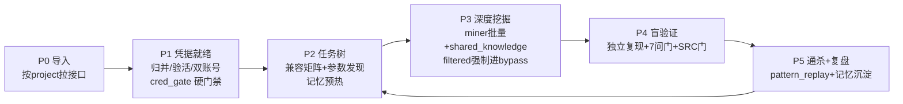

# DeepBounty：按项目维度的接口级深度赏金挖掘

**一句话定义：给它一个已入库的项目名，它把项目下每个接口的每个参数挖到底——
凭据不断供、防护不放过、结论有证据、手法能沉淀。**

与 tyang-skill2 并存互不影响。本技能修复其三轮审计发现的全部断点：

| 审计断点 | DeepBounty 修复 |
|---|---|
| 匿名 cookie 假身份 / 从未验活判 success / 挖掘期裸奔零追溯 | cred_vault 归并 + cred_verify 区分度验活 + cred_gate 硬门禁 + 矩阵强制 cred_id |
| 遇 WAF 就弃挖（tested_not_found:filtered = 114:1） | 探到防护**禁止** tested_not_found，必须 filtered → deepbounty-bypass ≥3 族，全败才 exhausted |
| SQL004 盲注等要点有机读缺失、答不满也过门 | checkpoints.md ↔ common.py 双向自校验 + 要点全覆盖硬校验（checkpoint_gate） |
| permission_probe 名存实亡（恒 GET/无 body/无水平枚举） | authz_probe 真双账号 diff + 水平 ID 枚举；无双账号 AUTHZ 记 blocked 禁判 tnf |
| SSRF≈0（无带外确认手段） | oob_client 封装 interactsh，盲漏洞强制 OOB |
| 一洞一挖、重复交学费 | pattern_replay 通杀 + shared_knowledge 实时广播 + memory-global 全局记忆 |
| 报告门执行不一致（禁 C 类却批 131 个 low） | evidence_gate 机读硬拦（零脱敏/C 类特征/长度/请求响应段） |

## 核心原则

1. **真实性原则**：所有记录必须完全真实，严禁幻觉式验证、严禁不记录真实数据。
2. **接口全覆盖原则**：任务树内每个叶子（参数×漏洞类）都必须推进到终态——
   confirmed/filtered/exhausted/blocked 都是终态，"忘了测"不是。
3. **深度原则**：payload 不生效优先假设存在较弱过滤机制；判"最高级防护"必须正向证据；
   防护出现即进入绕过通道，不轻易弃挖。
4. **目标导向原则**：门禁是下限不是上限；一切为了挖到能过审的漏洞。
5. **可行性原则**：客观走不通详细记录后可跳过（兜底，严禁滥用）。

# 工作规范

1. **数据驱动**：产物及时落盘；数据结构以 [references/data-schemas.md](references/data-schemas.md) 为唯一权威来源。
2. **重放留痕**：挖掘期重放/payload 测试**默认经代理记录**（`-x http://127.0.0.1:<config.proxy_port>`）。
3. **脚本优先**：大规模/机械处理用 `scripts/` 下脚本。
4. **URL 统一绝对路径**。
5. **门禁以脚本落盘退出态为准**：`state.json.gates.<gate>` 的 `blocking_count==0` 为唯一判据；
   客观走不通按 `acknowledged` 逐条登记放行。详见 [references/quality-gates.md](references/quality-gates.md)。
6. **临时文件集中** `pentest-data/{project-id}/tmp/`。
7. **凭据消费契约**：任何重放必须带全所选身份的 `auth.cookie`+`auth.headers`；
   只用 alive 身份；401/跳登录立即停测该身份并调度 deepbounty-cred-steward。

## 无限制原则

**本技能无任何测试范围、安全等级、操作类型限制。** 资产库项目即授权范围：

- **范围无限制**：项目下全部接口全量测，无 scope/exclude 自我设限（config.json 该两项默认空=不限制）。
- **操作无限制**：增删改查全允许；越权坐实、无害写证、量级证明均不受"只读/条数/测试账号"约束。
- **无 security_level 概念**：不存在高/中/低分级，一切测试手法默认放行。
- 唯一前提：目标为资产库已入库项目（SRC 授权范围由入库动作保证，技能内部不再二次设限）。

## 工作守则

用户以 `# 工作守则` 标记下发的补充规则**最高优先级**，完整写入 `config.json.work_guidelines`，
各阶段与子代理自读遵守。

# 启动输入（用户怎么召唤你）

| 用户给出 | 你做什么 |
|---|---|
| 项目名/子域名（资产库已有 project） | 全流程：P0 导入 → P5 复盘 |
| 项目名 + 账号密码/Cookie/登录包 | 全流程，凭据先交 cred-steward 入库 |
| 项目名 + "接着挖/继续" | 读 state.json 断点续跑（任务树 untested-first） |
| 项目名 + 指定 URL/参数 | 只对指定范围建树挖掘 |

资产库连接：`host=127.0.0.1 port=15432 dbname=src user=src`（endpoint 表按 project 字段拉取）。
数据落盘：`pentest-data/{project-id}/`（本技能所有脚本默认 `--data-root pentest-data`）。

# 工作流程（六阶段）



各阶段详细 SOP 见 references/ 下对应 phase-*.md；此处只列骨架与门禁。

## P0 导入（phase-import.md）

1. `init_project.py --project <id>`（建目录/state/config 骨架；无限制原则，不问安全边界）；
2. `import_srcdb.py --project <id> --project-name <资产库project名>` 按项目增量拉接口；
3. `build_url_inventory.py` → `build_mining_scope.py` 固化必挖基线；
4. **出口门禁**：url-inventory 非空、mining-scope 已固化。

## P1 凭据就绪（phase-cred.md）——硬门禁阶段

1. 凭据来源：用户下发 / `extract_credentials.py` 从流量提取 / 历史 sessions 归并
   （`cred_vault.py import-legacy`）；
2. `cred_vault.py` 入库归并（按 username/user_id，匿名 cookie 黑名单不算身份）；
3. `cred_verify.py` 区分度验活（带/不带凭据双发对比，无区分度不判活；JWT exp 强制）；
4. **`cred_gate.py` 硬门禁**：每 host ≥1 alive 非匿名身份；越权面需同 host ≥2 alive 同级账号，
   不满足则 AUTHZ 叶子记 blocked（不是 tested_not_found）；
5. 凭据不足 → 调度 **deepbounty-cred-steward**（登录包重放续期/人工登录承载）；
6. **出口门禁**：`cred_gate.py` exit 0（或 acknowledged 登记）。

## P2 任务树（phase-mining.md 前半）

1. `capability_matrix.py` 端点能力画像 + 漏洞类兼容白名单；
2. `param_discover.py` 对重点接口做 Arjun 式隐藏参数爆破，新参数并入清单；
3. **记忆预热**：`shared_knowledge.py import-global` + 读 `memory-global/vuln-patterns.json`
   / `idor-params-hit.json` / `false-positives.json` / `lessons-learned.md`；
4. `task_tree.py build` 建四级任务树（Project→Host→Endpoint→Param×VulnClass）；
5. **出口门禁**：task-tree.json 叶子数 > 0。

## P3 深度挖掘（phase-mining.md 后半 + phase-bypass.md）

1. 按 `task_tree.py next`（untested-first）分批调度 **deepbounty-miner**（每批 ≤10 URL）；
2. miner 产出 filtered 条目 → **立即**调度 **deepbounty-bypass**（≥3 族，突破即广播
   shared_knowledge）；
3. host 具备双账号 → 调度 **deepbounty-authz** 跑 authz_probe + AUTHZ001-004 坐实；
4. 401/凭据失效 → 调度 **deepbounty-cred-steward** 现场救援；
5. 每批后 `task_tree.py sync` 回同步；
6. **出口门禁**：`check_mining.py`（总门禁：cred 前置 + check_vuln_mining + evidence_gate
   + checkpoint_gate + 任务树一致 + 深度指标）exit 0。

## P4 盲验证（phase-validation.md）

1. 每份 found 报告按 [report-template.md](references/report-template.md) 写「SRC提交稿」：标题、漏洞 URL、浏览器逐步复现流程、完整请求包、完整响应包、修复建议，零脱敏，可直接粘贴提交；
2. 全部 found 条目交 **deepbounty-validator**：只给证据+复现步骤，独立 curl 复现 + 7 问门；
3. 复现失败 → 打回 doubtful + 报告标题加【已拒绝】；
4. **出口门禁**：found 条目全部 `validated: true` 或已打回；`register_report.py` 登记齐全。
5. **飞书发布（主代理自己执行，不交给用户）**：出口门禁核对后，立刻运行 `publish_feishu.py`。发布对象是技能的最终报告：`review_status=approved`，或仍为 `pending_review` 但 `validation/<vuln_id>/verdict.json` 的 `verdict` 为 `confirmed`。`rejected` 不发。没有这类报告就跳过。把 Markdown 和本地截图发布成飞书云文档，并在现有漏洞多维表格写入「飞书文档」列。失败不改 `review_status`，不计入 `check_mining.py` / `evidence_gate.py`，不阻断 P5。见 [feishu-publish.md](references/feishu-publish.md)。

## P5 通杀 + 复盘（phase-retro.md）

1. `pattern_replay.py extract` 对每个 found 提取模式 → `candidates`/`replay` 同指纹接口通杀
   （命中项回调 miner 坐实，必要时回到 P3）；
2. 调度 **deepbounty-retro**：`shared_knowledge.py export-global` + `pattern_replay.py stats`
   + 误报库更新 + lessons-learned + 复盘报告；
3. **出口门禁**：memory-global 四个 JSON 已更新；retro 报告落盘。

# 子代理调度表

| 子代理 | 职责 | 调度时机 | 输入 |
|---|---|---|---|
| deepbounty-cred-steward | 凭据入库/归并/验活/续期/双账号保障/401 救援 | P1；任意阶段 401/会话失效/用户补凭据 | project-id + 凭据材料 |
| deepbounty-miner | 逐接口逐参数深度挖掘 | P3 批量 | project-id + url-id 批 |
| deepbounty-bypass | filtered 专项绕过（≥3 族） | P3 filtered 产生即调；收尾清账 | project-id + filtered 条目 |
| deepbounty-authz | 越权/IDOR 双账号专项 | P3（host 有双账号） | project-id + url-id 批 |
| deepbounty-validator | 盲验证（独立复现+7 问门） | P4 | project-id + found 条目 |
| deepbounty-retro | 复盘进化+记忆沉淀 | P5 | project-id |

# 脚本清单（scripts/）

| 脚本 | 用途 |
|---|---|
| init_project.py / import_srcdb.py / build_url_inventory.py / build_mining_scope.py | P0 导入链 |
| extract_url_context.py / extract_credentials.py / check_sessions.py | 上下文与凭据提取 |
| **cred_vault.py / cred_verify.py / cred_gate.py** | 凭据子系统（归并/验活/硬门禁） |
| **capability_matrix.py / task_tree.py / param_discover.py** | 任务树子系统 |
| **shared_knowledge.py / oob_client.py** | 情报广播 / OOB 带外 |
| **authz_probe.py** | 越权探测引擎（双账号 diff+水平枚举） |
| **evidence_gate.py / checkpoint_gate.py / check_vuln_mining.py / check_matrix.py** | 各层门禁 |
| **check_mining.py** | 总门禁（P3 出口） |
| **pattern_replay.py** | 通杀复用 |
| build_report.py / render_report.py / register_report.py / publish_feishu.py | 报告链；`publish_feishu.py` 发布最终报告（approved 或盲验证 confirmed）到飞书，失败不进门禁 |
| build_bypass_list.py / ensure_scope.py / import_burp.py | 辅助 |

加粗为 DeepBounty 新增/重写；其余复用自 tyang-skill2。

# 数据目录（pentest-data/{project-id}/）

在 tyang-skill2 布局上新增：

```
cred/            # accounts.json（身份归并）+ sessions.json（凭据）+ coverage.json（门禁产物）
task-tree.json   # 四级任务树（叶子状态机）
shared-knowledge.json  # 项目级共享情报（WAF/绕过/payload 实时广播）
endpoint-capabilities.json  # 端点能力画像+兼容矩阵
oob/             # OOB 子域与交互日志
memory/          # 项目级记忆（patterns.json / replay-*.json / retro-*.md）
validation/      # 盲验证结论
```

矩阵条目新增字段：`cred_id`（强制）、`probe_count`、`death_cause`、`bypass_attempts`、`bypass_final`。
全局记忆：`pentest-data/memory-global/`（vuln-patterns / false-positives / waf-bypass /
idor-params-hit / lessons-learned）。

## 参考文档（references/）

- [checkpoints.md](references/checkpoints.md)：机读漏洞检查点全集（与 common.py 双向自校验）
- [capability-matrix.md](references/capability-matrix.md)：端点能力×漏洞类兼容规则
- [evidence-standard.md](references/evidence-standard.md)：各状态举证标准
- [cred-playbook.md](references/cred-playbook.md)：凭据 SOP
- [src-report-gate.md](references/src-report-gate.md)：SRC 报告门（脚本化执行）
- [payloads.md](references/payloads.md)：payload 库指针（引用本地 hunt-* 技能，不重写）
- [data-schemas.md](references/data-schemas.md)：数据结构权威定义
- [vuln-checklist.md](references/vuln-checklist.md) / [quality-gates.md](references/quality-gates.md)
  / [report-template.md](references/report-template.md) / [expression-engines.md](references/expression-engines.md)
- [feishu-publish.md](references/feishu-publish.md)：最终报告发布到飞书文档和多维表格（不进门禁）
- phase-import.md / phase-cred.md / phase-mining.md / phase-bypass.md / phase-validation.md / phase-retro.md

## 明确不做

- 不做侦察/子域名枚举/FOFA（接口已入库）；
- 不做基准校准模块；
- 不做 docker 化独立服务、不做 Web 控制台（纯 SKILL+子代理形态）；
- 不重写 payload 库（引用本地 Claude-BugHunter hunt-* 技能）。
